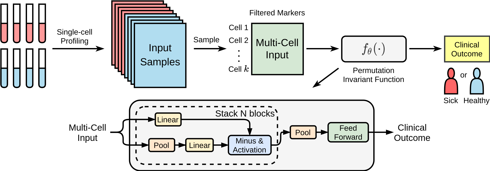

# CytoSet

[](https://circleci.com/gh/CompCy-lab/cytoset)

## Introduction

CytoSet is a deep-learning based method used for predicting clinical outcome from cytometry data.

<p align="center">

</p>

## Installation

### Requirements

- Python >= 3.6
- CUDA >= 10.1

```
pip install -r requirements.txt
```

### Datasets

AML dataset is from https://flowrepository.org/id/FR-FCM-ZZYA. HEUvsUE dataset is from https://flowrepository.org/id/FR-FCM-ZZZU.
ICS dataset is from https://flowrepository.org/id/FR-FCM-ZZZV. NK_cell dataset is from the repository of [CellCNN](https://github.com/eiriniar/CellCnn). 

The pre-processed dataset for training the model can be downloaded from the [google drive](https://drive.google.com/drive/folders/1chfsOYSCsRg7kcydqyrze6B1Sg9-iInL?usp=sharing).


## Reproducing Results

### Training

* Download pre-processed the datasets (see Datasets Section) and unpack them.
* In ``scripts/train/train_[Dataset].sh``, set ``bin_file`` to the path of ``train.py`` and ``gpu`` to the gpu id.
* Start training: ``bash train_[Dataset].sh``

## Citing

TBD


## Contact

If you have any questions, please feel free to contact Haidong Yi (haidyi@cs.unc.edu) or push an issue on Issues Dashboard.


